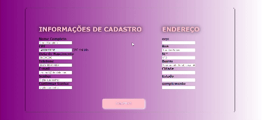

<h1 aling="center">Projeto Cadastro</h1>

1. Neste Readme vou explicar oque foi feito [nesta atividade](https://caiotico.github.io/formCadastro/login.html).

Atividade
-------

### EX01
* Aqui neste link está localizado o [exercicio 01](https://caiotico.github.io/formCadastro/login.html) que nele aprendi um pouco mais sobre `Java Script`.

Explicação
-------
Criei um codigo de formulario de Cadastro, onde o código preenche automaticamente os campos de endereço ao você digitar o `CEP`.<br>
### GIF TELA
<br>

O códio de Java Script se localiza Abaixo.
```ruby
 'use strict'; //Modo "Restrito"
//Consumindo API de CEP, do ViaCep
// https://viacep.com.br/

//Limpa o Form (do CEP pra baixo)...
const limparFormulario = (endereco) =>{
    document.getElementById('rua').value = '';
    document.getElementById('bairro').value = '';
    document.getElementById('cidade').value = '';
    document.getElementById('estado').value = '';
}

//Preenche os campos relacionados ao CEP...
const preencherForumulario = (endereco) =>{
    document.getElementById('rua').value = endereco.logradouro;
    document.getElementById('bairro').value = endereco.bairro;
    document.getElementById('cidade').value = endereco.localidade;
    document.getElementById('estado').value = endereco.uf;
}

//Verifica se o CEP é válido...
const eNumero = (numero) => /^[0-9]+$/.test(numero); //Expressão Regular
// É possível testar e entender a RegEx em https://www.regexpal.com/
const cepValido = (cep) => cep.length == 8 && eNumero(cep);

//Consumindo API... 2- passo
const pesquisarCep = async() => {
    limparFormulario();
    const url = `https://viacep.com.br/ws/${cep.value}/json/`;
    
    if(cepValido(cep.value)){
        const dados = await fetch(url); //await = esperar
        const addres = await dados.json(); // fetch = promessa
        
        // hasOwnProperty  retorna um booleano indicando se o objeto possui a propriedade especificada como uma propriedade definida no próprio objeto em questão
        if(addres.hasOwnProperty('erro')){ 
            // document.getElementById('rua').value = 'CEP não encontrado!';
            alert('CEP não encontrado!');
        }else {
            preencherForumulario(addres);
        }
    }else{
        // document.getElementById('rua').value = 'CEP incorreto!';
        alert('CEP incorreto!');
    } 
}

//Adicionando um evento DOM, no input CEP... 1- passo
document.getElementById('cep').addEventListener('focusout', pesquisarCep);


function CPF(){
    "user_strict";
    function r(r){
        for(var t=null,n=0;9>n;++n)
        t+=r.toString().charAt(n)*(10-n);
        var i=t%11;return i=2>i?0:11-i
    }
        function t(r){
            for(var t=null,n=0;10>n;++n)t+=r.toString().charAt(n)*(11-n);
            var i=t%11;return i=2>i?0:11-i
        }
        var n="CPF Inválido",i="CPF Válido";
        this.gera=function(){
            for(var n="",i=0;9>i;++i)n+=Math.floor(9*Math.random())+"";
            var o=r(n),a=n+"-"+o+t(n+""+o);return a
        }
        ,this.valida=function(o){
            for(var a=o.replace(/\D/g,""),u=a.substring(0,9),f=a.substring(9,11),v=0;10>v;v++)if(""+u+f==""+v+v+v+v+v+v+v+v+v+v+v)return n;
            var c=r(u),e=t(u+""+c);
            return f.toString()===c.toString()+e.toString()?i:n
        }}


   var CPF = new CPF();
//    document.write(CPF.valida("123.456.789-00"));
   
//    document.write("<br> Utilizando o proprio gerador da lib<br><br><br>");
   for(var i =0;i<40;i++) {
      var temp_cpf = CPF.gera();
      document.write(temp_cpf+" = "+CPF.valida(temp_cpf)+"<br>");
   }

$("#input").keypress(function(){
    $("#resposta").html(CPF.valida($(this).val()));
});

$("#input").blur(function(){
     $("#resposta").html(CPF.valida($(this).val()));
});
```
Lnk para colocar no `HTML`
```
<script src="https://ajax.googleapis.com/ajax/libs/jquery/2.1.1/jquery.min.js"></script>
```
## Fontes Consultadas
`GitHub`<br>
`Técnico de Informatica`<br>
`Stack Overflow`<br>
